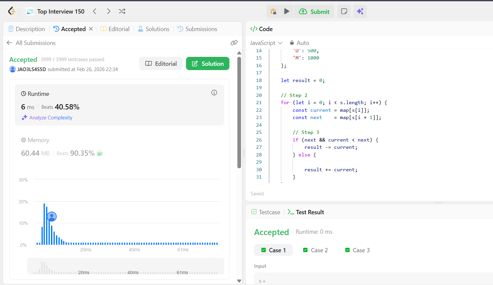

## Bonus

```javascript
var romanToInt = function (s) {
  // Step 1
  const map = {
    I: 1,
    V: 5,
    X: 10,
    L: 50,
    C: 100,
    D: 500,
    M: 1000,
  };

  let result = 0;

  // Step 2
  for (let i = 0; i < s.length; i++) {
    const current = map[s[i]];
    const next = map[s[i + 1]];

    // Step 3
    if (next && current < next) {
      result -= current;
    } else {
      result += current;
    }
  }

  return result;
};
```


