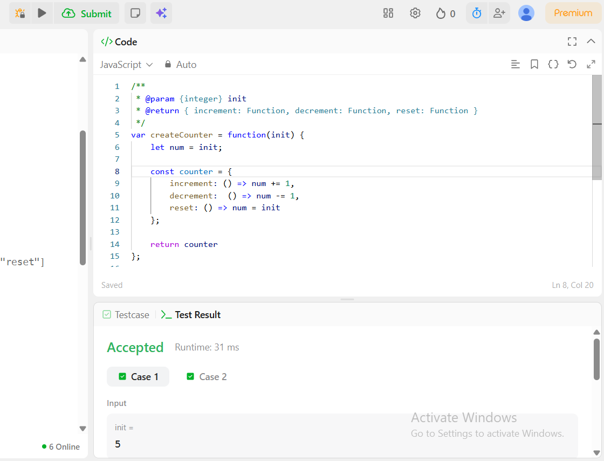

# Part 2: Bonus 
---

```javascript
var createCounter = function (init) {
  let num = init;

  const counter = {
    increment: () => (num += 1),
    decrement: () => (num -= 1),
    reset: () => (num = init),
  };

  return counter;
};

const counter = createCounter(5);
counter.increment(); // 6
counter.reset(); // 5
counter.decrement(); // 4
```
---

