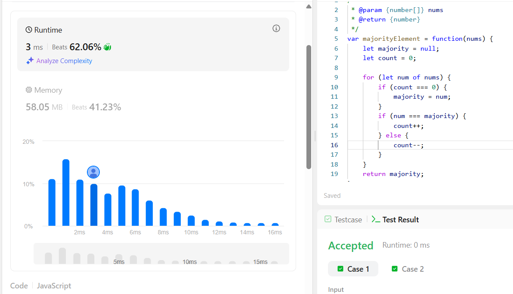

# Bonus

```javascript 
var majorityElement = function(nums) {
    let majority = null;
    let count = 0;
    
    for (let num of nums) {
        if (count === 0) {
            majority = num;
        }
        if (num === majority) {
            count++;
        } else {
            count--;
        }
    } 
    return majority;
};
```

