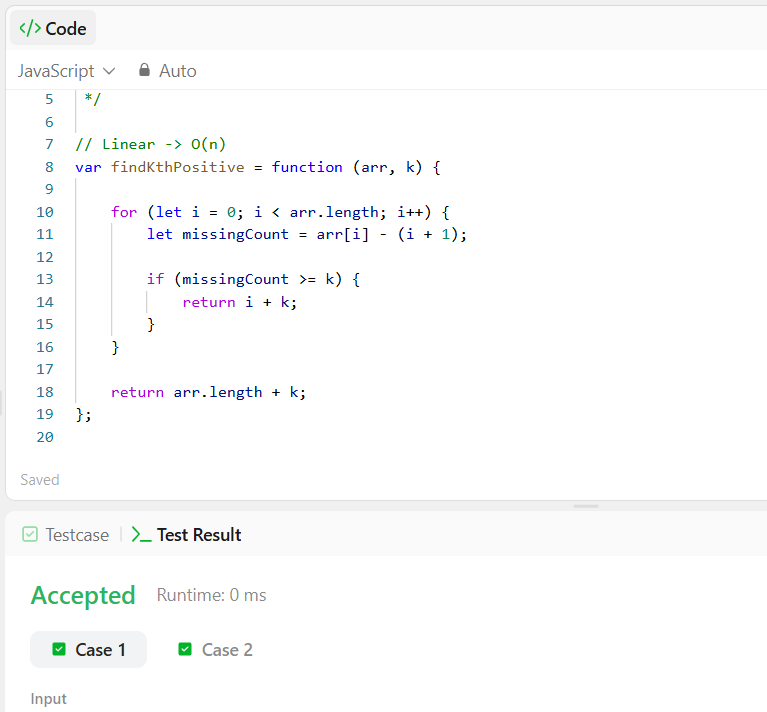
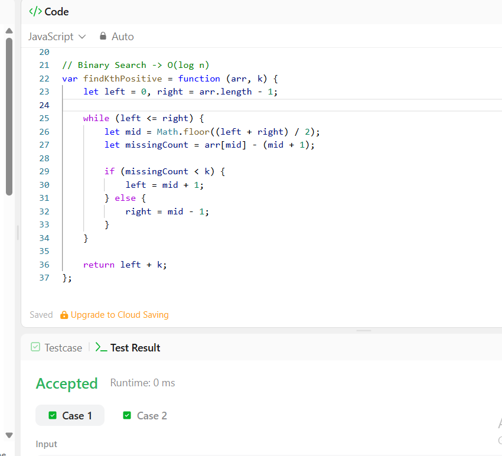

# Part 2: Bonus 
---

## Linear -> O(n)
```javascript
var findKthPositive = function (arr, k) {

    for (let i = 0; i < arr.length; i++) {
        let missingCount = arr[i] - (i + 1);

        if (missingCount >= k) {
            return i + k;
        }
    }

    return arr.length + k;
};
```
---


---

## Binary -> O(log n)
```javascript
var findKthPositive = function (arr, k) {
    let left = 0, right = arr.length - 1;

    while (left <= right) {
        let mid = Math.floor((left + right) / 2);
        let missingCount = arr[mid] - (mid + 1);

        if (missingCount < k) {
            left = mid + 1;
        } else {
            right = mid - 1;
        }
    }

    return left + k;
};
```
---

